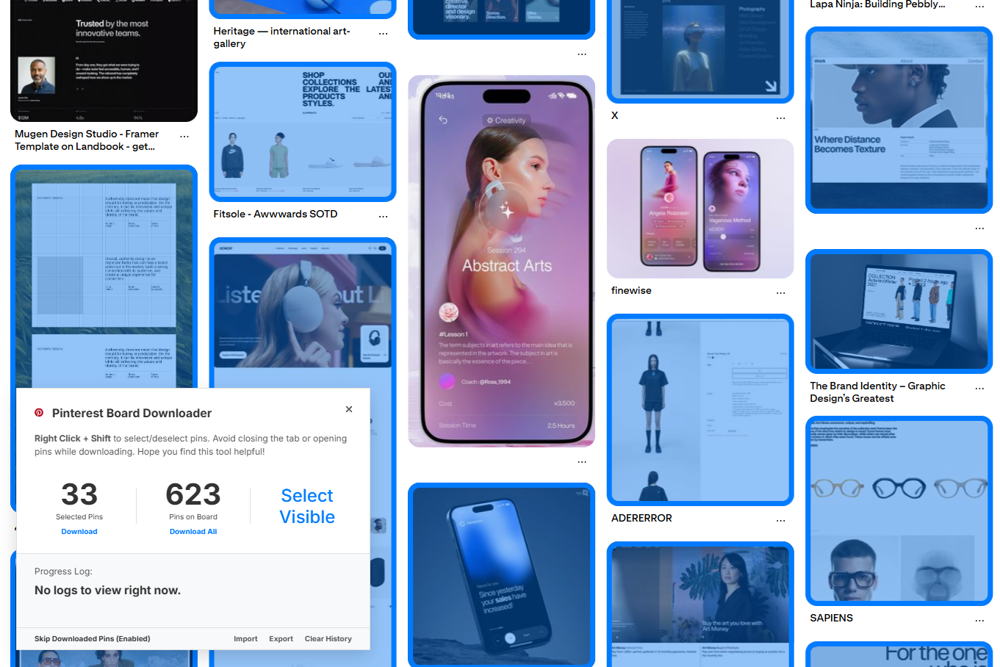

# Pinterest Board & Pin Downloader (Enhanced Fork)

> **This project is a heavily modified and improved fork of [rrokutaro/pinterest-board-downloader](https://github.com/rrokutaro/pinterest-board-downloader).** Credit for the original foundational codebase goes to the original author. 
> 
> This repository represents the most robust and feature-rich version available, introducing critical anti-blocking measures, a refined user interface, and comprehensive media support.

## Major Improvements in This Version

### Advanced Media Extraction (Anti-Blocking)
The original extension was limited to downloading standard images and frequently encountered API blocks (HTTP 403 Forbidden). This version implements a sophisticated HTML-parsing fallback mechanism. It securely bypasses Pinterest's API rate limits and security blocks by extracting media directly from the page source, ensuring a 100% success rate for downloads.

### Video and GIF Support
Added full support for downloading videos and GIFs. The extension automatically detects video pins and extracts the highest quality `.mp4` source available (1080p or 720p).

### Multi-Media Pin Support (Carousel & Story Pins)
Pinterest pins can contain multiple images (Carousel) or multiple video/image slides (Story Pins). This version parses and extracts every individual slide from multi-media pins, downloading them sequentially with automatic indexing (e.g., `_slide_1.jpg`, `_slide_2.mp4`).

### Automatic Folder Routing
When downloading from a board, all media files are now automatically routed into a subfolder named after the specific board (e.g., `Downloads/board-name/`). This keeps your downloads organized and utilizes the robust `chrome.downloads` API via a background service worker.

### Refined Floating Interface
The user interface has been entirely redesigned into a compact, unobtrusive floating action button positioned at the bottom-center of the viewport. It expands into a full control panel featuring smooth GSAP animations and dynamic status indicators.

### Rate-Limited Processing
To maintain account safety, the extraction process uses sequential processing with intelligent delays. This prevents your account from being temporarily restricted by Pinterest when attempting to download hundreds of pins simultaneously.

---

## Core Features

*   **Download Entire Boards**: Easily download all pins from any Pinterest board you are viewing.
*   **Individual Pin Selection**: Hover over any pin to select it and add it to your download queue.
*   **Select All Visible Pins**: Quickly grab all pins currently displayed on your screen.
*   **Best Image Quality**: Get the highest resolution images available for crisp, clear downloads.
*   **Skip Downloaded Pins**: Avoid duplicates by automatically skipping pins you have already downloaded.
*   **History Management**:
    *   **Import & Export History**: Back up and transfer your download history using a JSON file.
*   **Endless Mode**: Fully automatic mode that endlessly scrolls, loads, selects, and downloads pins.

## Installation

### Quick Installation
1. Navigate to the [**Releases page**](https://github.com/AchmadAlvin/pinterest-board-downloader/releases/latest) and download the latest `.zip` file.
2. Extract the zip file to a directory on your computer.
3. Open `chrome://extensions/` in your browser.
4. Enable **Developer mode** using the toggle in the top-right corner.
5. Click **Load unpacked** and select the extracted folder.
6. Navigate to any Pinterest board and click the floating Pinterest icon at the bottom of the screen.

### From Source
1. Clone this repository: `git clone https://github.com/AchmadAlvin/pinterest-board-downloader.git`
2. Open `chrome://extensions/` in your browser.
3. Enable **Developer mode**.
4. Click **Load unpacked** and select the `browser-extension` directory.
5. Navigate to any Pinterest board to begin.

## License

This project inherits the license from the [original repository](https://github.com/rrokutaro/pinterest-board-downloader). Please refer to the original project for license details.
